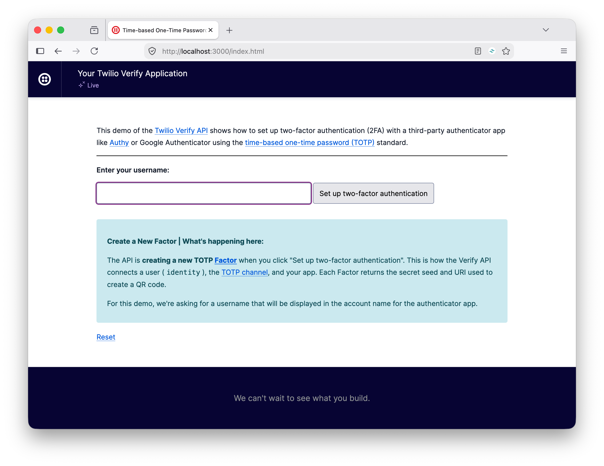
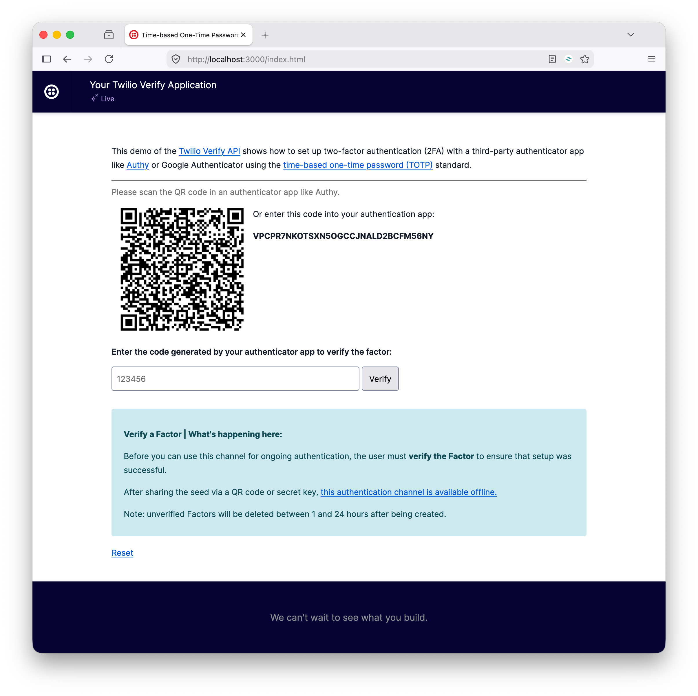
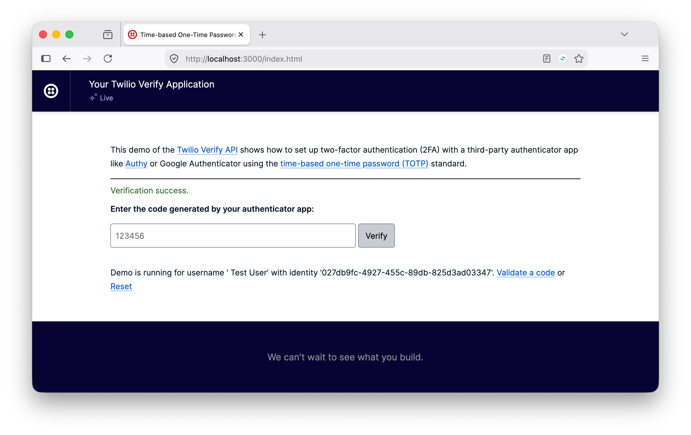

:allow-uri-read: true
:experimental: true
:issues: https://github.com/twilio-samples/twilio-verify-passwordless-authentication-go/issues
:mit-license: https://mit-license.org
:ngrok: https://ngrok.com/
:prs: https://github.com/twilio-samples/twilio-verify-passwordless-authentication-go/pulls
:try-twilio: https://www.twilio.com/try-twilio
:twilio-account-sid: https://help.twilio.com/articles/14726256820123-What-is-a-Twilio-Account-SID-and-where-can-I-find-it-
:twilio-console: https://console.twilio.com
:twilio-verify-docs: https://help.twilio.com/articles/360033309133-Getting-Started-with-Twilio-Verify-V2#h_01KM1A0E689D78DKPS6R7QR7P1
:e164-format: https://www.twilio.com/docs/glossary/what-e164
= Passwordless Authentication With Twilio Verify in Go

This project demonstrates how to implement passwordless authentication via OTP in Go using Twilio Verify.

== Prerequisites

To run the app locally, you need the following:

* {try-twilio}[A Twilio account with] an active phone number that can send SMS
* Go
* Your preferred code editor or IDE
* Your preferred web browser
* Some terminal experience is helpful, though not required

== Quickstart

=== Core setup

To set up the project, clone it locally, and change into the project directory.

[source,bash]
----
git clone git@github.com:twilio-samples/twilio-verify-passwordless-auth-totp-go.git twilio-verify-passwordless-auth-totp-go
cd twilio-verify-passwordless-auth-totp-go
----

=== Set the required environment variables

To do that, copy _.env.example_ to _.env_.

[source,bash]
----
cp .env.example .env
----

Here is a list of the environment variables that need to be set, along with what they're for.

[cols="15h,~,~",stripes=none]
.Required environment variables
|===
| Variable
| Format
| Where to find

| `TWILIO_ACCOUNT_SID`
| Starts with `AC`.
.2+| A {twilio-account-sid}[Twilio Account SID] can be found on {twilio-console}[the Twilio Console] dashboard under *Account Info*.

| `TWILIO_AUTH_TOKEN`
| 32-char string.
Treat it as a password.

| `TWILIO_VERIFY_SERVICE_SID`
| 32-char string.
Starts with `VA`.
| The Twilio Console → Verify → Services.
Find out more detail {twilio-verify-docs}[in the documentation].
|===

=== Start the application

Finally, start the application running locally.

[source,bash]
----
go run main.go
----

The application will start on port 8080.

You can now navigate to http://localhost:8080 to test the TOTP Factor creation process.

Enter a username of your choice and click btn:[Set up two-factor authentication].

You will be redirected to the *Verify New TOTP Factor* form.
With your authentication app, scan the QR code, enter the 6-digit code that it generates into the form, and click btn:[Verify].

You'll then be redirected to the *Enter TOTP Code* form, where you'll see whether the Factor was set up successfully or not, as in the screenshot above.

If the Factor was set up successfully, enter the next 6-digit code into the *Enter TOTP Code* form and click btn:[Verify]. 
Again, you should see if it was successfully verified or not, as in the screenshot above.

== Contributing

If you want to contribute to the project, whether you have found issues with it or just want to improve it, here's how:

* {issues}[Issues]: ask questions and submit your feature requests, bug reports, etc
* {prs}[Pull requests]: send your improvements

== License

{mit-license}[MIT]

== Disclaimer

No warranty expressed or implied.
Software is as is.
